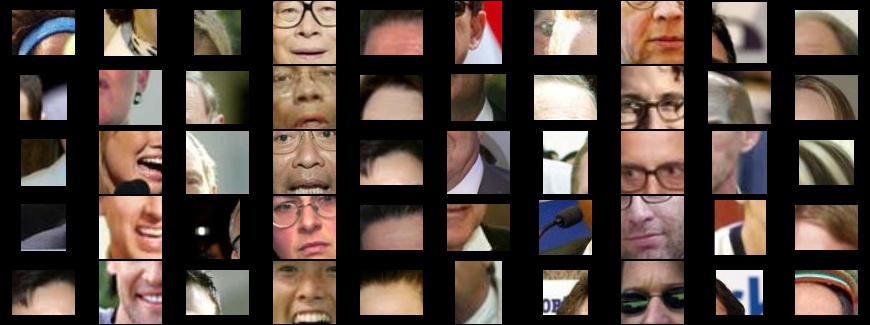
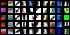
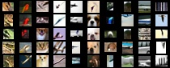
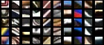
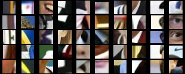
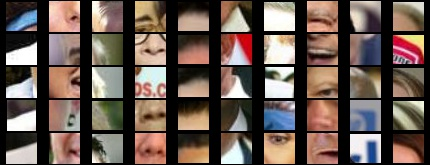

# Visualizing strongest activations

This repo implements one way to visualze what a convolutional network has learned.
It finds images that make network neurons fire the most.

Let's say we are interested in what the [FaceNet](https://github.com/davidsandberg/facenet) model has learned.
We look at how filters in some convolutional layers fire
in response to different images.
Here is what 10 filters in one of the layers fire on.
For each filter we visualize top 5 image patches.




### Installation
```
# Clone this repo if you have not yet.
git clone https://github.com/kukuruza/strongest_conv_activations
TF_VISUALIZE_DIR=$(pwd)/strongest_conv_activations

# Install prerequisites.
pip install opencv-python
pip install progressbar2
```

### Example: cifar10

```
# Get cifar10 tutorial and export its path.
git clone https://github.com/tensorflow/models
CIFAR_DIR=$(pwd)/models/tutorials/image/cifar10

# Train the model with Cifar10 dataset.
cd $CIFAR_DIR
python cifar10_train.py

# Compute images that get the highest response on conv1 and conv2 layers.
# The output will be at /tmp/cifar10_activations/
cd $TF_VISUALIZE_DIR
python cifar10_activations.py --cifar10_dir $CIFAR_DIR
```

Layer `conv1`:



Layer `conv2`:




### Example: FaceNet

```
# Clone FaceNet repo
git clone https://github.com/davidsandberg/facenet
cd facenet
FACENET_DIR=$(pwd)

# Download trained weights from a gdrive link at the official repo.
# The model is Inception ResNet v1 20170512-110547.
python $TF_VISUALIZE_DIR/utils/download_from_gdrive.py 0B5MzpY9kBtDVZ2RpVDYwWmxoSUk 20170512-110547.zip
unzip 20170512-110547.zip

# Download face image dataset "lfw".
wget http://vis-www.cs.umass.edu/lfw/lfw.tgz
tar -xzf lfw.tgz

# Compute images that get the highest response on 5 different layers.
# The output will be at /tmp/facenet_activations/
cd $TF_VISUALIZE_DIR
python facenet_activations.py --facenet_dir $FACENET_DIR --model_path $FACENET_DIR/20170512-110547.pb --lfw_dir $FACENET_DIR/lfw
```

**Optional**: If you want to pick layers yourself, you can study the network graph.
To do that you can export the graph to logs and visualize it in TensorBoard:
```
# Generate logs to visualize the network graph on Tensorboard.
python utils/generate_logs.py --model 20170512-110547 --logdir 20170512-110547/logs

# Note that the graph shows tf operation names. In this network architecture,
# operation "my/op" outputs tensor with name "my/op:0".
tensorboard --logdir 20170512-110547/logs
```

Layer `Conv2d_2b`:



Layer `Conv2d_4a`:



Layer `Conv2d_4b`:



Layer `Repeat-block35_1-add0`. This a layer inside one of the inception blocks:


### Usage

We are given a dataset and a CNN architecture with trained weights.
Now we want to find which images in the dataset get highest response
in each channel in some chosen layers.

The algorithm runs it two steps.
In the first step, you run your dataset through the model to obtain
the feature maps of the layers that you picked to visualize.
In the second step, you calculate the receptive field of the top
activations in those layers and visualize it.

In the first step, objects of class `Activations` are created,
one per channel per layer. 
Then the algorithm loops through the dataset, and `Activations`
objects save the strongest responses.
The work of `Activations` class is straightforward:
monitoring filter responses for each new batch of images and bookkeeping.

In the second step, objects of class `ReceptiveField` are created, one per layer.
See `cifar10_activations.py` and `facenet_activations.py` for an example.
Class `ReceptiveField` uses a more involved algorthm to compute 
the receptive field for individual pixels in a feature map.
This algorithm is described in the next section.


# Automatically compute receptive field

Compute receptive field for each pixel of a selected layer in a CNN.
We will compute receptive fields fully automatically for any network architecture.
The examples are a cut version of the examples in the previous section.

### Example: cifar10

```
# Get cifar10 tutorial and export its path.
git clone https://github.com/tensorflow/models
CIFAR_DIR=$(pwd)/models/tutorials/image/cifar10

# Compute images that get the highest response on conv1 and conv2 layers.
# Visualizations will be at /tmp/cifar10_recfield/
cd $TF_VISUALIZE_DIR
python cifar10_recfield.py --cifar10_dir $CIFAR_DIR
```

### Example: FaceNet

```
# Clone FaceNet repo
git clone https://github.com/davidsandberg/facenet
cd facenet
FACENET_DIR=$(pwd)

# Download trained weights from a gdrive link at the official repo.
# The model is Inception ResNet v1 20170512-110547.
python $TF_VISUALIZE_DIR/utils/download_from_gdrive.py 0B5MzpY9kBtDVZ2RpVDYwWmxoSUk 20170512-110547.zip
unzip 20170512-110547.zip

# Compute receptive field for five layers.
cd $TF_VISUALIZE_DIR
python facenet_recfield.py --facenet_dir $FACENET_DIR --model_path 20170512-110547/20170512-110547.pb
```

**Optional**: If you want to pick layers yourself, you can study the network graph.
To do that you can export the graph to logs and visualize it in TensorBoard:
```
# Generate logs to visualize the network graph on Tensorboard.
cd $TF_VISUALIZE_DIR
python utils/generate_logs.py --model 20170512-110547 --logdir 20170512-110547/logs

# Note that the graph shows tf operation names. In this network architecture,
# operation "my/op" outputs tensor with name "my/op:0".
tensorboard --logdir 20170512-110547/logs
```

### Usage

The algorithm is implemented as `ReceptiveField` class
in `recfield.py`. One instance of the class computes
receptive field of all feature points in one layer.

The class object needs to know how to compute a feature map.
Pass a layer-specific `forward_func` function to the contructor.
This function should take an image batch as an argument,
run the forward pass on it and output a feature map.

For example, let's look at `cifar10_recfield.py`.
Notice how `forward_func` passes its argument `x` to the Tensorflow
session method `sess.run` as an image placeholder.

```
forward_func = lambda x: sess.run([layer], feed_dict={ images_ph: x })
recfield = ReceptiveField(imshape, forward_func)
```

Another argument of `ReceptiveField` constructor 
is the image batch shape `imshape`.
It must be in the form of `[batchsize, height, width, channels]`

#### A note about BatchNorm

Now look at `forward_func` in `facenet_recfield.py`.
Notice how the training phase placeholder is set to false:
```
forward_func = lambda x: sess.run([layer], feed_dict={ images_ph: x, phase_train_ph: False })
```
Setting it to false is important because
of BatchNorm layers in FaceNet.
During training, BatchNorm makes *any* pixel affect
*any* feature point during the training phase.
So make sure to set the phase variable, 
if there is one, to testing/evaluation.,
otherwise batch normalization layers will kill the magic.

#### Getting the output

Once the object is constructed,
you get the receptive field for the layer, e.g. `5 x 5`.
You also get bounding boxes `[y_1, x_1, y_2, x_2]`
of the receptive field for each point in a feature map.
The shape of the map is thus `mapwidth x mapheight x 4`.

There is also a utility function `draw_example()` to visualize
a receptive field of a neuron in the center of the feature map.

### Algorithm

Internally the class generates and passes forward carefully designed images
and tracks which pixel in the image affects which pixel in the feature map.
That is, the receptive field is computed directly, by definition.


